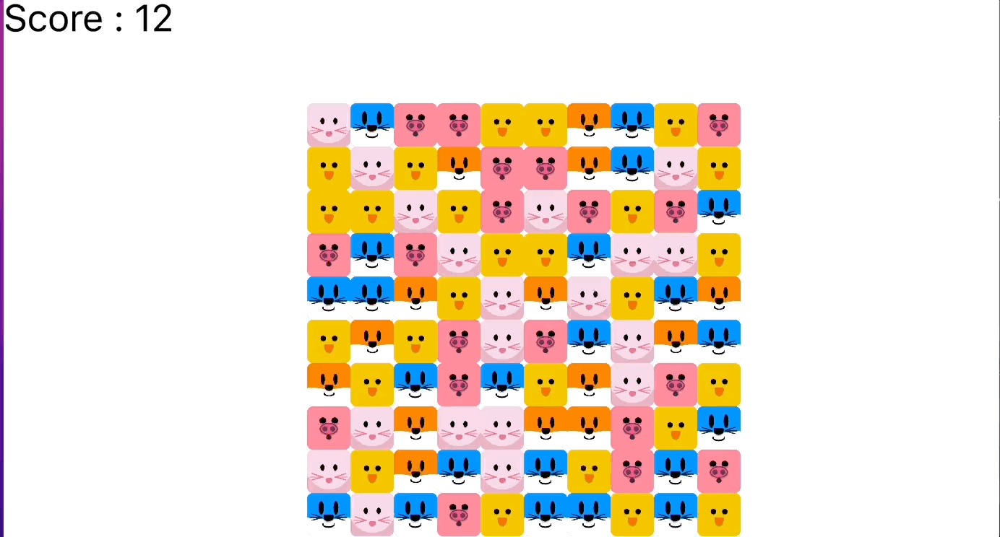

# Cpp_MatchThreePuzzle_Qt

Cpp- Qt6를 이용한 MatchThreePuzzle 게임 제작해보기 (Consts.h 에 원하는 이미지들의 경로를 넣고 빌드하면 된다)
아래 주요코드설명 + 주석으로 간단 설명.

## Qt란

초기에는 크로스플랫폼 GUI 라이브러리로 시작했고 UI 개발 도구,
번역 작업을 위한 도구와 C++ 개발에 필요한 많은 기능(UI, XML, 네트워크, SVG, Animation, Container Class 등등)을 제공하는 범용적인 응용프로그램 프레임워크

## Qt 사용 이유

OpenGL, DirectX와 같이 그래픽 모듈은 선행할게 많음. 현재 cpp의 클래스, 헤더 등 구분등을 게임에서 어떤식으로 나누나에 대해 배우기 위해 해보는 프로젝트 이므로,
사용이 보다 용이하고, 멀티플랫폼을 지원하는 Qt를 사용하기로 한다.
실제 아직도 Qt Framework를 이용해 만들어진 프로그램이 많으므로 추후에도 도움이 될거라 생각했다.

## 프로젝트 내용.

Consts.h -> 프로젝트에서 공용으로 사용되는 공통 변수들을 저장(BOARD_SIZE, Img_path등..)

board.h & board.cpp -> match three puzzle을 플레이하는 보드에 필요한 함수들을 구성 ( 보드 구성, remove Item 등...)

main.cpp -> main.cpp

Item.h & Item.cpp -> QGraphicsPixmapItem을 상속받아 내부 아이템 요소들의 변수를 따로 제작해줌. (모든 item들이 MouseEvent를 상속받기 위해)
-> mousePressEvent, mouseReleaseEvent 를 override해서 구현. qDebug

## 배운점

EventListener\* \_listener; 에서 생성자에서 초기화 후 사용하려 할때, 실수로 초기화를 안했던 문제가 있었다.
이 이후코드에서는 빈 메모리에 접근하여 강제종료를 일으켰고 강제종료된 프로그램이 안사라져 곤란했었다... 메모리 사용은 항상 조심하자.

## 주요 코드 설명

코드 한줄한줄 설명은 생략하며 전체코드중 일부분만 적는다. 세부설명은 주석을 참조하자.

#### 아이템
각 이미지들이 아이템 역할을 한다

```cpp
    class EventListener{            // 이벤트 전달해주는 listener제작.
    public:
        virtual void itemDragEvent(Item* item, Direction dir) = 0;
        virtual void itemMoveFinished(Item* item, Item* item2) = 0;
    };

    Item(EventListener* listener,const std::string& path, int row, int column, QGraphicsRectItem* root);
```
추후 애니메이션등에서 EventListener을 호출한다. 아래서 설명할 Board가 이를 상속한다.

class Board : public Item::EventListener

#### 보드 생성

```cpp
Board::Board(QGraphicsScene* scene, QGraphicsSimpleTextItem* text)
    : _scene(scene), _gen(_rand()), _moveCount(0), _text(text)
{
    _scene -> addItem(&_root);
    _scene -> addItem(&_text);
    _text.setScale(4);
    _text.setText(("Score : " + std::to_string(_score)).c_str());
    _root.setX(_scene->sceneRect().width() / 2 - (Consts::BOARD_SIZE / 2 * Consts::ITEM_SIZE) ); // 맥북에서는 싱글모니터니까 /2 , 듀얼모니터환경에선 오른쪽기준 * 1.5
    _root.setY(_scene->sceneRect().height() / 2 - (Consts::BOARD_SIZE / 2 * Consts::ITEM_SIZE) );
    for(int row = 0; row < Consts::BOARD_SIZE; ++row)
    {
        std::vector<Item*> _row(Consts::BOARD_SIZE); // 보드의 사이즈를 미리 지정해둔다.
        _items.push_back(_row);
        for(int column = 0; column < Consts::BOARD_SIZE; ++column)
        {
            addItem(row,column);
        }
    }

    refreshBoard();
}
```
Board.cpp 파일의 일부이자, 생성자이다. 듀얼모니터는 화면 2개 크기의 합을 전체크기로 입력받으므로, 수정이 필요할 수 있다.

아래는 main.cpp의 일부이다
```cpp:main.cpp
    //

    QApplication a(argc, argv);         // Application
    QScreen* screen = QGuiApplication::primaryScreen();

    QRect geometry = screen->geometry();
    // QGuiApplication의 primaryScreen()으로 주 화면을 얻은 다음, 해당 화면의 geometry() 메서드를 이용하여 기하학적 영역에 대한 정보를 QRect 타입의 변수인 geometry에 저장
    QGraphicsScene scene;               // 여기에 만든 오브젝트들이 담긴다.
    QGraphicsSimpleTextItem text;

    scene.setSceneRect(geometry);       // 좌표기준을 primaryScreen으로 변경 없으면 0,0(가운데)가 기준이되버린다.

    Board board(&scene, &text);
    
```
이와같이 어플리케이션 생성후, 신에 추가 한후 보드 생성해준다 (생성자 호출)

#### Item 움직이기

여러 함수가 엮여있지만 exchangeItems가 최종관리한다.
```cpp
void Board::exchangeItems(int row0, int row1, int column0, int column1){
    Item* item0 = _items[row0][column0];
    Item* item1 = _items[row1][column1];
    item0->setRow(row1);
    item1->setRow(row0);
    item0->setColumn(column1);
    item1->setColumn(column0);

    _items[row0][column0] = item1;
    _items[row1][column1] = item0;

    item0->moveTo(item1);
    item1->moveTo(item0);
    _moveCount+=2;
    isExchange = true;
}
```
위 함수는 item의 moveTo를 호출하며, 여기선 애니메이션을 호출한다.
```cpp:item.cpp
void Item::moveTo(Item *other)
{

    double toX =  other->x();
    double toY = other->y();   // 거리가 먼 만큼 이동해야하므로, diff를 구해주자.
    double diffX =  toX - x();
    double diffY = toY - y();
    double time = 0;
    time+= qAbs(diffX) / Consts::BOARD_SIZE * Consts::AnimationTime; // qAbs(diffX) / boardsize하면 개수가 나올것이고, 거기에 animationtime을 곱한다.
    time+= qAbs(diffY) / Consts::BOARD_SIZE * Consts::AnimationTime; // 어차피 상,하,좌,우 만 움직이므로 diffX,diffY중 하나는 0일거기때문에 둘다 time에서 관리
    QTimeLine* timer = new QTimeLine(time);     //시간만큼 애니메이션을 이용한다. timeline에 관련한걸 handling 할때 사용함
    QGraphicsItemAnimation* animation = new QGraphicsItemAnimation();// 그래픽 item 애니메이션은 여기서.
    animation -> setTimeLine(timer);
    animation->setItem(this);       // Item이 상속받은 GraphicsItem이 this
    animation->setPosAt(0, pos());
    animation->setPosAt(1,QPointF(toX,toY));//시작과 끝 지정

    timer->start();

    connect(timer, &QTimeLine::finished, [this,timer,animation, other]()   //일종의 콜백. 애니메이션이 완료되면 람다함수 실행
            {
                delete timer;
                delete animation;
                other->isMoving = false;
                _listener->itemMoveFinished(this, other);
            });        //animaiton이 완료될때 어떤행동할지 정함
}
```
각 item들의eventListner이 애니메이션이 끝날때 할 행동을 지정해준다.
```cpp
void Board::itemMoveFinished(Item *item, Item* item2)
{
    if(--_moveCount>0)
        return;

    if(refreshBoard()){
        return;// 매칭되는것이 있다면 리턴
    }
    if(item == nullptr || item2 == nullptr) return;

    if(isExchange)
    {
        exchangeItems(item->getRow(), item2->getRow(), item->getColumn(), item2->getColumn());  // 만약 매칭되는게 없다면 다시 원래자리로,
        item -> isMoving = true;
        item2 -> isMoving = true;
        isExchange = false;
    }
}
```
itemMoveFinished의 일부이다

```cpp:item.cpp
void Item::mousePressEvent(QGraphicsSceneMouseEvent* event)
{
    _pressPos = event -> pos();
//    qDebug() << "Pressed : " <<event->pos();
}

void Item::mouseReleaseEvent(QGraphicsSceneMouseEvent* event)
{

    QPointF releasePos = event -> pos();
    QPointF diff = releasePos - _pressPos;
    Direction dir;
    if(diff.x() == 0 && diff.y() == 0) return;  // 움직이지 않았을 때
    if(qAbs(diff.x()) > qAbs(diff.y()))     // 수평이동값이 수직이동값보다 클 경우에,
    {
        if(diff.x() > 0)                    // 오른쪽으로 간 경우.
        {
            dir = Direction::Right;
        }
        else{                               // 왼쪽으로 갈 경우.
            dir = Direction::Left;
        }
    }else{                                  // 수직 이동값이 수평이동값 보다 큰 경우에.
        if(diff.y() > 0)
        {
            dir = Direction::Down;
        }else{
            dir = Direction::Up;
        }

    }
    _listener->itemDragEvent(this, dir);
    //    qDebug() << "Released : "<< this <<event->pos();
}
```
드래그 관리는 item내부에서 구현하며 자동호출되는 함수들이다. 마우스가 때졌을시 이전에 eventList(선언은 item.h이지만 override해서 사용하므로 구현은 board.cpp) 에서 
itemDragEvent호출후 이동 방향을 설정한다. 

```cpp:board.cpp
// (itemDragEvent의 일부)
    switch(dir)
    {
    case Item::Direction::Left:
        column1--;
        break;
    case Item::Direction::Right:
        column1++;
        break;
    case Item::Direction::Up:
        row1--;
        break;
    case Item::Direction::Down:
        row1++;
        break;
    }
```

#### Item 삭제 (3개 이상이 맞춰줬을떄 삭제하기)

##### 아이템 3개이상을 맞추기 위해 요소하나하나를 넣어주기
MatchSet = std::set<std::pair<int,int>> 이다

```cpp

MatchSet Board::matchedItems() const
{
    MatchSet matched; //3개이상 뭉치는것들이 들어갈것
    for (int row = 0; row < \_items.size(); ++row) // 9\*9 기준으로 \_items.size()는 9이다. (햇갈리지 말자)
    {
        for(int column = 0; column < \_items[row].size(); ++column)
        {
            MatchSet m = matchedItems(row, column);
            if(m.size() >= 3)
            {
            matched.insert(m.begin(), m.end());
            }
        }
    }
    return matched;
}

```

##### overloading으로 row, column이 넘어왔을때 검사하기 위함.

```cpp

MatchSet Board::matchedItems(int row, int column) const
{
    MatchSet horizontalMatched = matchedItemHorizontal(row, column);
    MatchSet verticalMatched = matchedItemVertical(row, column);

    MatchSet matched;
    if(horizontalMatched.size() >= 3)
    {
        matched.insert(horizontalMatched.begin(), horizontalMatched.end());
    }else if(verticalMatched.size() >= 3)
    {
        matched.insert(verticalMatched.begin(), verticalMatched.end());
    }

    return matched;

}
```

##### 세로로 3개이상 같은것이 있나 검사하는 코드 (이하 matchedItemVertical 은 생략하기)

```cpp
MatchSet Board::matchedItemHorizontal(int row, int column) const // 수평으로 맞는거 구하기
{
    Item\* item = \_items[row][column];
    if(item == nullptr) return {};

    MatchSet Matched;
    for(int i = column - 1; i >= 0; --i)
    {
        if(_items[row][i] != nullptr && _items[row][i]->getPath() == item->getPath())   // 비어있지않고 이미지가 같다면. (경로가 같다면)
        {
            Matched.insert({row , i});      // pair를 대입하고
        }
        else{
            break;                              // 아니면 break 하기
        }
    }

    for(int i = column + 1; i < Consts::BOARD_SIZE; ++i)
    {
        if(_items[row][i] != nullptr && _items[row][i]->getPath() == item->getPath())   // 비어있지않고 이미지가 같다면. (경로가 같다면)
        {
            Matched.insert({row , i});      // pair를 대입하고
        }
        else{
            break;                              // 아니면 break 하기
        }
    }

    if(Matched.size() + 1 >= 3) // 매칭 완료
    {
        Matched.insert({row, column});      // 자기자신은 빠져있으므로 포함시켜준다
        return Matched;
    }
    else{
        return {};
    }

}
```

##### 보드 초기화 시키기

```cpp
bool Board::refreshBoard()
{
    // 위에있는 Item들 아래로 내려주기
    MatchSet m = matchedItems();
    if(m.size() < 3) return false;
    else
    {
        _score += m.size();
        _text.setText(("Score : " + std::to_string(_score)).c_str());
    }
    for(const auto& match : m)
    {
        removeItem(match.first, match.second);
    }
    for(int column = 0; column < _items[0].size(); ++column)
    {
        for(int row = _items.size() - 1; row >= 0; --row) //아래서부터 탐색을해야 내려오는것까지 빠짐없이 체크한다.
        {
            if(_items[row][column] != nullptr) continue;
            else{
                for(int i = row - 1; i >= 0; i--)
                {
                    if(_items[i][column] != nullptr)
                    {
                        moveItem(i,column, row, column);
                        _items[i][column] = nullptr;
                        break;
                    }

                }
            }
        }

    }
    // 빈칸 채우기
    std::vector<int> emptyCounts;       //중간부터 내려오는게 아닌 위에것들이 내려오는 애니메이션을 위해 row 별 빈칸 개수 체크
    for(int column = 0; column < _items[0].size(); ++column)
    {
        int emptyCount = 0;
        for(int row = 0; row < _items.size(); ++row)
        {
            if(_items[row][column] == nullptr) emptyCount++;
            else break;
        }
        emptyCounts.push_back(emptyCount);
    }

    for(int row = 0; row <_items.size(); ++row)
    {
        for(int column = 0; column <_items[0].size(); ++column)
        {
            if(_items[row][column] == nullptr)
            {
                addItem(row, column);
                Item* item = _items[row][column];
                item->setY(item->y() - emptyCounts[column] * Consts::ITEM_SIZE);
                moveItem(item, row, column);
            }
        }
    }
    return true;
}

void Board::removeItem(int row, int column){
    auto* item = _items[row][column];
    if(item == nullptr) return;
    _items[row][column] = nullptr;
//    item -> setParentItem(nullptr);     // nullptr로 부모님을 뺴주고,(인데 삭제하면 자동으로 부모에서빠지니 굳이인가 싶다)
    _scene->removeItem(item);           // 아이템 제거후

    delete item;                        // 메모리에서 해제해줌.
}
```

refreshBoard는 아이템이 내려오는것(파괴되었을때) 을 관리하며 3개이상 모여서 파괴되었을때 true 아닐때 false를 리턴해준다.

여기까지가 코드의 일부를 설명했다.
긴 코드는 아니지만 전부를 적기에는 너무 많으므로 여기서 줄인다.
